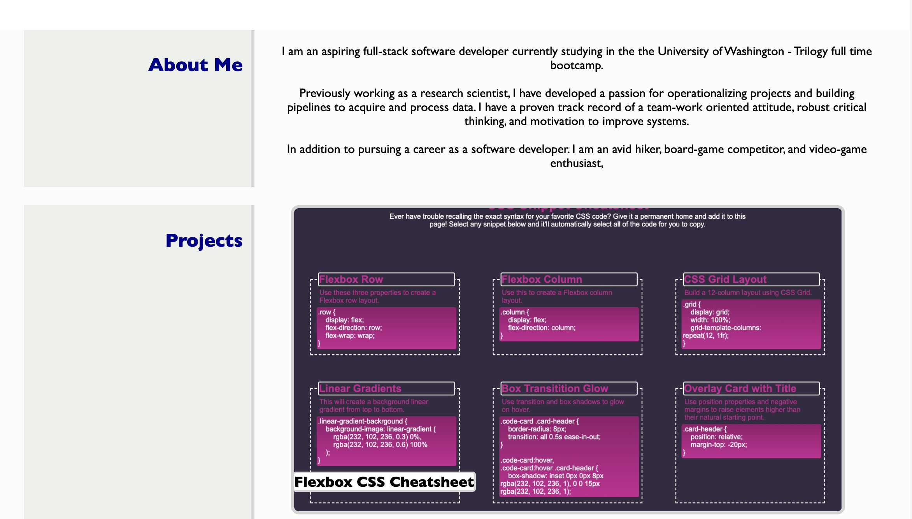
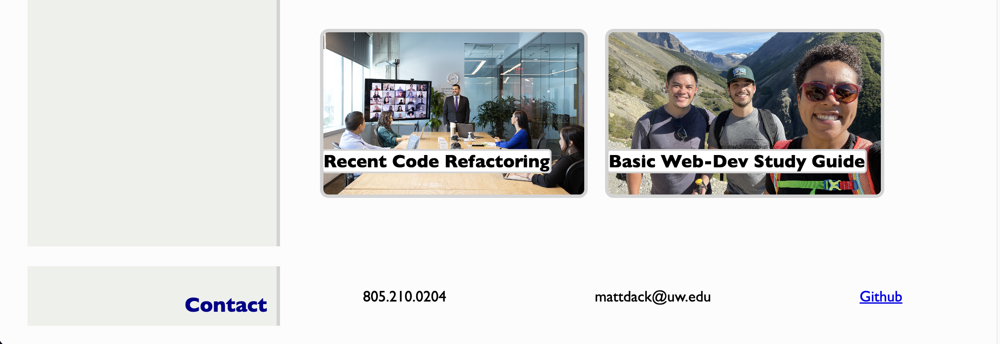

# Personal Website

## Description 

This [Personal Website](mattdack.github.io/personal-website), is acting as an introduction to my coding experience, a display of my coding portfolio, and listing of contact information. The webpage utilizes semantic HTML:5 and CSS to aesthetically generate a landing page with professional photo, a section describing me, a section for my portfolio, and a section for contact information. Flexbox and relative positioning were used to generate the layout. The page is responsive to different screen sizes.

## Screenshot of Webpage

## Installation

There is no installation required or capable with this repository. Running the index.html file in a default browser renders a static webpage that is identical to the one found at [here](mattdack.github.io/personal-website).

## Usage 

Select the links in the header navigation bar to move to main sections on the webpage. Select the photos for each portfolio item to get taken to the Github repository for each project.

## Credits

All of the code for this project was written by Matthew Dacanay. You can find other projects by Matthew at his [github page](github.com/mattdack).
